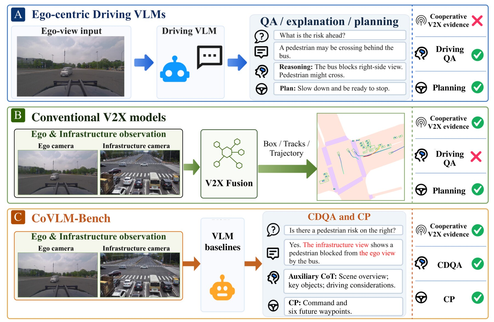
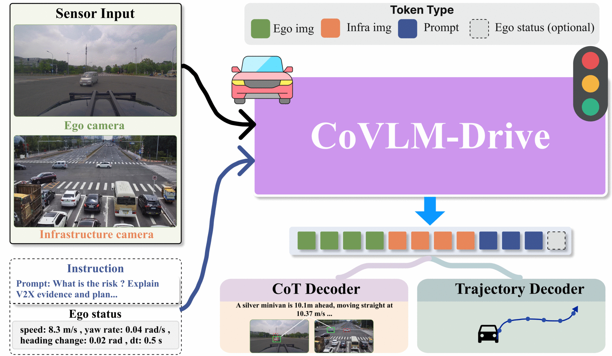
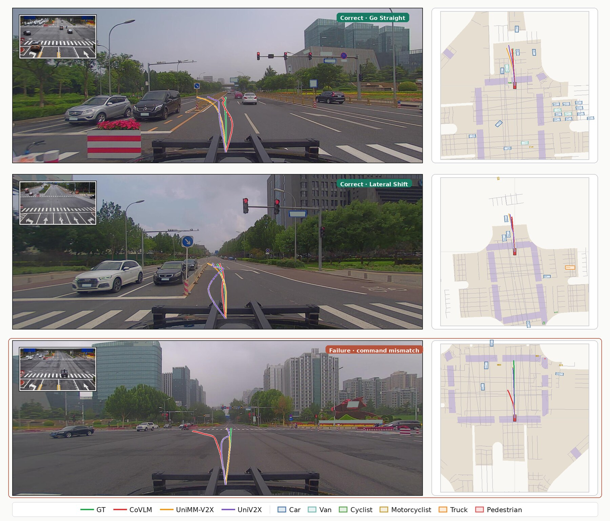

<div align="center">

# CoVLM-Bench

**A Real-World Benchmark for Cooperative Driving Question Answering and Planning**

<p>
  <a href="https://sidiangongyuan.github.io/CoVLM-Bench/"></a>
  
  
  
  <a href="LICENSE"></a>
</p>

<p>
  <a href="#whats-in-this-release">Release scope</a> &middot;
  <a href="#cooperative-planning-results">Results</a> &middot;
  <a href="#roadmap">Roadmap</a> &middot;
  <a href="docs/INSTALL.md">Install</a> &middot;
  <a href="docs/TRAIN_EVAL.md">Train / Eval</a> &middot;
  <a href="docs/BASELINES.md">Baselines</a>
</p>



</div>

## Overview

Vision--language models have made substantial progress in autonomous driving, but
their success has primarily been studied in ego-centric scenes. Infrastructure-side
observations provide views beyond the ego vehicle's field of view, yet cooperative
driving systems typically transform them into geometric representations for
downstream perception and planning. Directly incorporating these views into VLMs
offers an opportunity to improve cooperative scene understanding and trajectory
planning.

**CoVLM-Bench** is a benchmark for two tasks on vehicle--infrastructure paired
scenes:

- **CDQA** -- cooperative driving question answering, with scene-grounded
  annotations over traffic participants, ego maneuvers, and roadside observations.
- **CP** -- cooperative planning, predicting six waypoints over a three-second
  horizon from targets derived from recorded ego motion.

Three-part rationales (*scene overview*, *V2X-aware critical objects*,
*decision reasoning*) are provided as auxiliary supervision rather than as a
separate task.

**CoVLM-Drive** is a unified VLM baseline that places the ego image, the roadside
image, and the prompt in a single input sequence, adapts the backbone with LoRA,
and adds structured command and waypoint heads for planning.

<p align="center"></p>

## What's in this release

This is a **staged release**. The current snapshot covers the **cooperative
planning task end to end**, together with the reproduction code for the compared
V2X planners. The question-answering annotations, the CDQA evaluation protocol,
and the released data stores follow later; see the [roadmap](#roadmap).

| Component | Status |
| --- | --- |
| CoVLM-Drive training and evaluation (CP) | Available |
| Structured command / waypoint heads, three-part rationale supervision | Available |
| Resolved configurations of every CoVLM-Drive run reported for CP | Available |
| UniV2X / UniMM-V2X / MAP reproduction code and configs | Available |
| CP result tables and table-building scripts | Available |
| V2X-Seq-SPD data conversion and evaluation utilities | Available |
| CDQA annotations, prompts, scorer | Coming soon |
| Three-part rationale annotation store | Coming soon |
| Annotation generation pipeline | Coming soon |
| Zero-shot planning baseline driver | Coming soon |
| Model checkpoints | Coming soon |

## Cooperative planning results

654 validation examples; six waypoints over a three-second horizon. L2 is the mean
Euclidean distance to the reference waypoints at each horizon, and FDE is L2 at
3.0 s. Efficiency is measured with batch size one on an RTX 4090. `--` denotes an
unreported or inapplicable entry. Machine-readable values:
[`results/cp_results.json`](results/cp_results.json).

| Method | 1.0 s | 2.0 s | **FDE** | Cmd Acc. | Bal. Acc. | Lat. (ms) | FPS | Mem. (GiB) |
| --- | --- | --- | --- | --- | --- | --- | --- | --- |
| *Task-trained V2X planners* | | | | | | | | |
| UniV2X | 2.079 | 3.831 | 5.861 | -- | -- | 812.7 | 1.23 | 2.86 |
| UniMM-V2X&dagger; | 1.677 | 3.427 | 5.357 | 0.8165 | 0.6604 | 523.9 | 1.91 | 3.29 |
| MAP&dagger; | 1.408 | 3.233 | 5.240 | 0.8394 | 0.7297 | 588.6 | 1.70 | 2.71 |
| *CoVLM-Drive backbone variants* | | | | | | | | |
| **Qwen3-VL-8B (standard CP)** | 1.500 | 3.119 | **4.911** | 0.7706 | 0.5661 | 223.1 | 4.48 | 17.08 |
| Qwen3-VL-8B + ego status | 1.515 | 3.207 | 5.126 | 0.7401 | 0.5497 | 180.1 | 5.55 | 17.11 |
| Qwen2.5-VL-7B | 1.530 | 3.241 | 5.120 | 0.7569 | 0.5355 | 273.8 | 3.65 | 16.23 |
| InternVL3-8B | 1.493 | 3.145 | 5.076 | 0.7324 | 0.5557 | 305.1 | 3.28 | 16.08 |
| LLaVA-OneVision-7B | 1.555 | 3.284 | 5.272 | 0.7385 | 0.5309 | 280.9 | 3.56 | 16.19 |
| Idefics3-8B | 1.691 | 3.525 | 5.538 | 0.7492 | 0.5850 | 1070.6 | 0.93 | 19.24 |
| *Zero-shot VLMs* | | | | | | | | |
| Qwen3-VL-8B | 3.640 | 7.311 | 11.227 | 0.6468 | 0.2387 | -- | -- | -- |
| InternVL3-8B | 6.828 | 13.397 | 20.007 | 0.6774 | 0.2500 | -- | -- | -- |

&dagger; our protocol-aligned reproduction. UniV2X is evaluated from the released
predictions. The full table, including every horizon, parse rates, and the
remaining zero-shot backbones, is in
[`docs/RESULTS.md`](docs/RESULTS.md).

The standard CP configuration reaches a lower FDE than the compared V2X planners
and runs with lower latency, while MAP retains the stronger command metrics.
Trajectory accuracy on recorded ego motion is not a closed-loop safety
measurement.

<p align="center"></p>

## Roadmap

Items are listed in intended release order. No dates are promised.

| # | Item | Status |
| --- | --- | --- |
| 1 | CP training, evaluation, configurations, and baseline reproduction | Released |
| 2 | CDQA annotations and the neutral object catalog | Coming soon |
| 3 | CDQA evaluation protocol, prompts, and scorer | Coming soon |
| 4 | Three-part rationale annotation store | Coming soon |
| 5 | Annotation generation and verification pipeline | Coming soon |
| 6 | Zero-shot planning and zero-shot CDQA baseline drivers | Coming soon |
| 7 | CoVLM-Drive checkpoints | Coming soon |
| 8 | Roadside-input control evaluation files | Coming soon |

## Quick start

```bash
git clone https://github.com/sidiangongyuan/CoVLM-Bench.git
cd CoVLM-Bench
pip install -r requirements.txt
```

Then follow, in order:

1. [`docs/INSTALL.md`](docs/INSTALL.md) -- environment and dependencies.
2. [`docs/DATA_PREP.md`](docs/DATA_PREP.md) -- obtaining V2X-Seq-SPD and building
   the training index.
3. [`docs/TRAIN_EVAL.md`](docs/TRAIN_EVAL.md) -- training and evaluating
   CoVLM-Drive on CP.
4. [`docs/BASELINES.md`](docs/BASELINES.md) -- reproducing UniV2X, UniMM-V2X,
   and MAP.

## Repository layout

```
projects/
  covla_baseline/          CoVLM-Drive
    train.py               training entry point
    evaluate.py            evaluation entry point (L2, FDE, command metrics)
    benchmark.py           inference-cost measurement
    three_part_cot.py      rationale target construction and parsing
    models/                backbone wrapper, waypoint and command heads,
                           roadside feature adapter
    data/                  prompts, command vocabulary, sample construction,
                           batching, evidence and geometry features, index build
    configs/               resolved configurations of the reported CP runs
    tools/                 run drivers, ablation queues, baseline scripts,
                           table builders
  mmdet3d_plugin/          UniV2X-derived modules for the compared V2X planners
  configs_e2e_univ2x/      configurations for UniV2X and UniMM-V2X
tools/                     V2X-Seq-SPD conversion, evaluation, launch scripts
results/                   reported CP metrics in machine-readable form
docs/                      installation, data, training, baselines, results
assets/                    figures used by this README and the project page
```

## Data

CoVLM-Bench is built on paired vehicle- and infrastructure-side frames from
**V2X-Seq-SPD / DAIR-V2X-Seq**. The underlying images and cooperative labels are
obtained from that dataset under its own access terms and are **not
redistributed** here. The CoVLM-Bench annotation layers are released separately;
see the [roadmap](#roadmap).

## License and attribution

This repository is released under the [Apache License 2.0](LICENSE).

It includes code derived from [AIR-THU/UniV2X](https://github.com/AIR-THU/UniV2X),
also under Apache-2.0; see [NOTICE](NOTICE). The compared planners UniV2X,
UniMM-V2X, and MAP are prior work by their respective authors, reproduced here
under a shared evaluation protocol.

## Citation

A citation entry will be added once the preprint is online.
